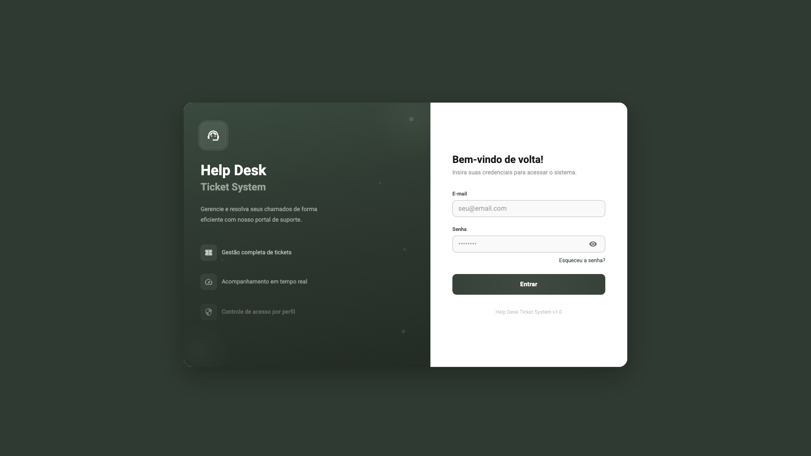
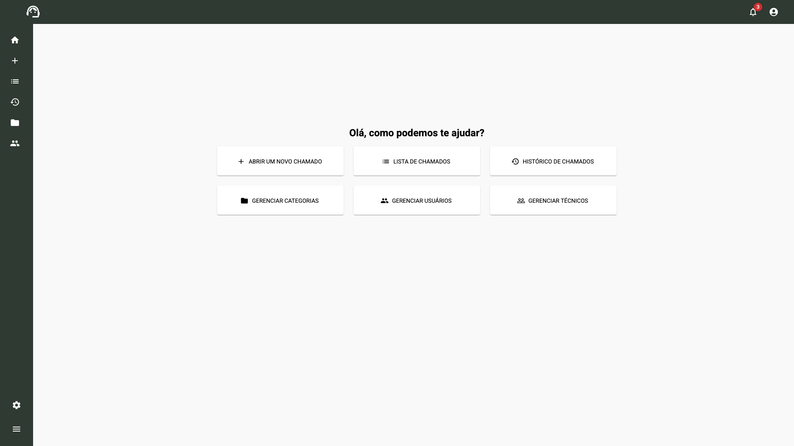
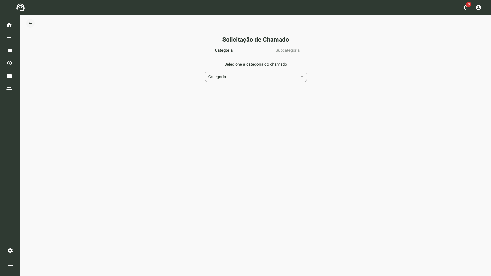
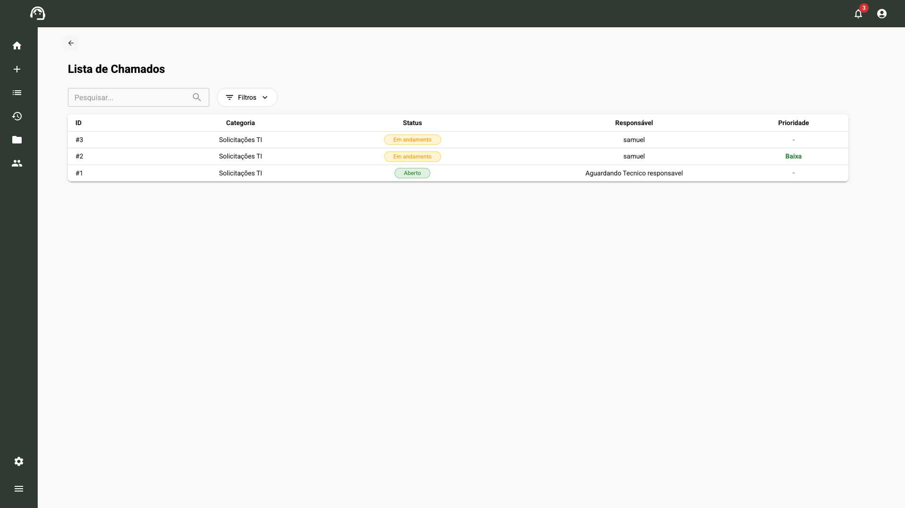
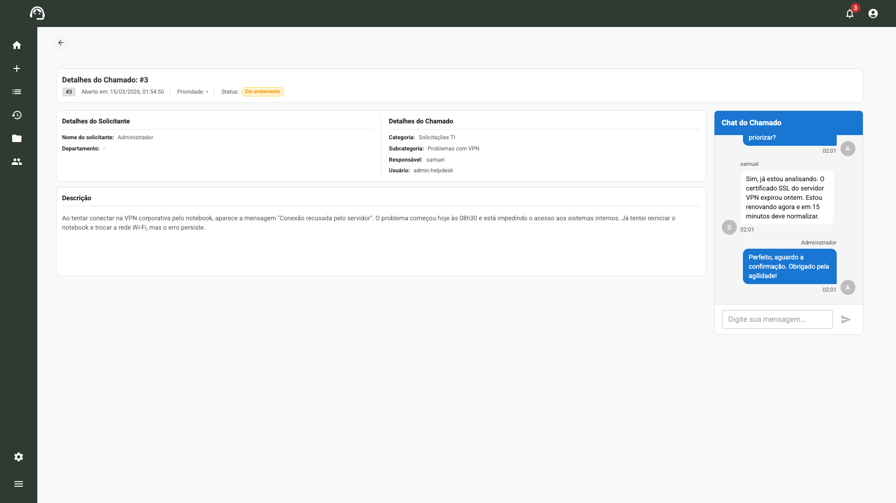
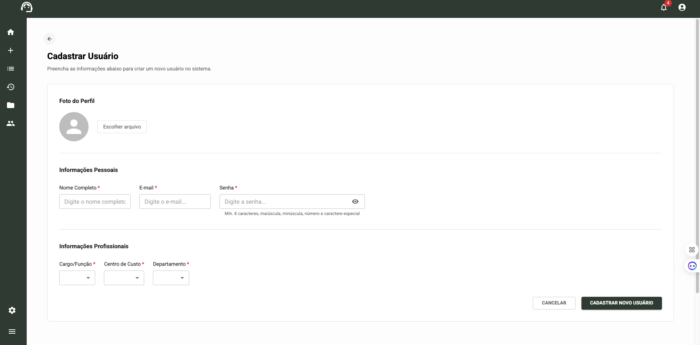
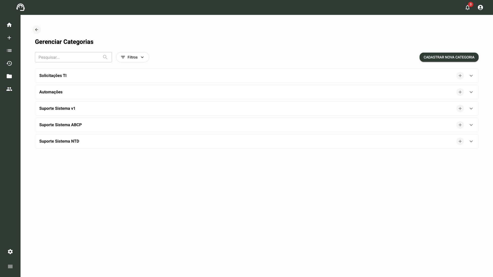
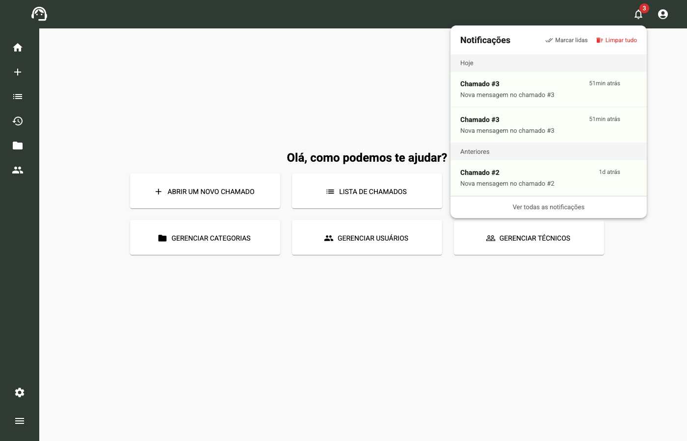
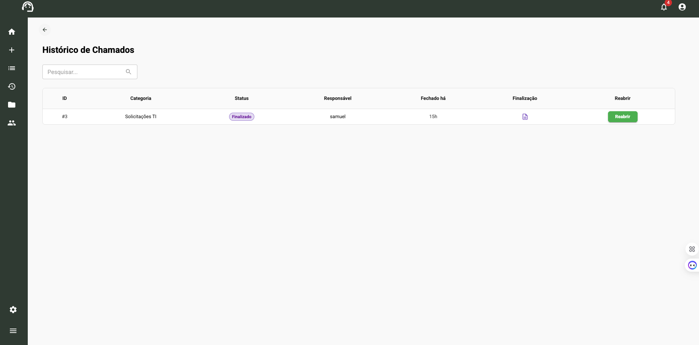
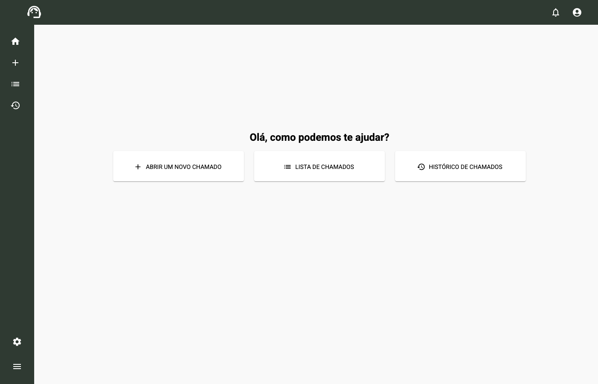

# Help Desk Ticket System

Sistema full stack para gerenciamento de chamados internos de suporte. Desenvolvido com **Node.js**, **React** e **APIs REST**, com autenticacao, controle de acesso baseado em perfis (RBAC) e fluxo completo de gerenciamento de tickets.


---

## Screenshots

### Tela de Login


### Dashboard (Administrador)
> Painel principal do administrador com acesso completo a todas as funcionalidades do sistema.



### Abertura de Chamado
> Formulario de abertura com selecao de categoria, subcategoria, prioridade e campos dinamicos.



### Lista de Chamados
> Visao administrativa com todos os chamados do sistema, filtros e status em tempo real.



### Detalhe do Chamado com Chat
> Tela de acompanhamento com chat integrado entre solicitante e tecnico responsavel.



### Cadastro de Usuarios
> Formulario completo para criacao de usuarios com foto de perfil, dados pessoais, cargo, centro de custo e departamento.



### Gerenciar Categorias


### Notificacoes
> Sistema de notificacoes em tempo real com alertas de novos chamados, mensagens e finalizacoes. Suporte a marcar como lida e limpar historico.



### Historico de Chamados
> Consulta de chamados finalizados com opcao de reabertura dentro da janela de 48 horas. Exibe categoria, responsavel e tempo desde o fechamento.



### Dashboard (Usuario Comum)
> Visao de um usuario com perfil "Usuario" — menu lateral simplificado com acesso apenas a abertura de chamados, lista pessoal e historico. Sem acesso a funcoes administrativas.



---

## Visao Geral

Em empresas de medio e grande porte, a gestao de chamados internos de suporte e frequentemente feita por e-mail ou planilhas, o que gera perda de rastreabilidade, atrasos e falta de visibilidade para gestores.

O **Help Desk Ticket System** resolve esse problema centralizando todo o fluxo de abertura, acompanhamento e resolucao de chamados em uma unica plataforma web. O sistema permite que colaboradores abram solicitacoes de suporte, acompanhem o status em tempo real, e que administradores e tecnicos gerenciem, priorizem e resolvam os chamados de forma organizada.

### Principais objetivos:
- Eliminar a comunicacao descentralizada de chamados
- Oferecer rastreabilidade completa do ciclo de vida de cada ticket
- Garantir controle de acesso e permissoes por perfil de usuario
- Fornecer um fluxo de aprovacao financeira integrado

---

## Funcionalidades

### Gestao de Chamados
- Abertura de chamados com categorias e subcategorias
- Formularios dinamicos por subcategoria (campos customizaveis)
- Atribuicao de chamados a tecnicos responsaveis
- Fluxo de status: **Aberto** > **Em Andamento** > **Finalizado**
- Niveis de prioridade (Baixa, Media, Alta)
- Reabertura de chamados com registro de motivo
- Upload de anexos nos chamados
- Sistema de mensagens internas por chamado (chat)
- Historico completo de chamados

### Autenticacao e Autorizacao
- Login com e-mail e senha
- Autenticacao via **JWT** com expiracao de 4 horas
- Controle de acesso baseado em perfis (RBAC)
- Rotas protegidas no frontend e backend
- Fluxo de recuperacao de senha por e-mail

### Aprovacao Financeira
- Flag de aprovacao obrigatoria em chamados
- Fila de aprovacao para gestores
- Status de aprovacao: Pendente, Aprovado, Rejeitado
- Registro de motivo de aprovacao/rejeicao

### Gestao Administrativa
- CRUD de usuarios com atribuicao de perfil e departamento
- CRUD de categorias e subcategorias
- Gestao de centros de custo e departamentos
- Gestao de tecnicos e permissoes por categoria
- Upload de avatar/foto de perfil
- Ativacao/desativacao de usuarios

### Notificacoes
- Notificacoes em tempo real por evento:
  - Novo chamado criado
  - Chamado finalizado
  - Chamado atribuido
  - Aprovacao aprovada/rejeitada
- Controle de lido/nao lido

---

## Regras de Negocio e Permissoes

### Perfis de Acesso (RBAC)

O sistema implementa controle de acesso baseado em perfis com tres niveis:

| Perfil | ID | Descricao |
|---|---|---|
| **Administrador** | 1 | Acesso total ao sistema. Visualiza todos os chamados, gerencia usuarios, categorias e tecnicos. |
| **Tecnico** | 2 | Responsavel por assumir e resolver chamados. Visualiza apenas chamados vinculados as suas categorias. |
| **Usuario** | 3 | Abre chamados e acompanha o status. Visualiza apenas seus proprios chamados. |

### Visibilidade de Chamados por Perfil

A logica de visibilidade e aplicada no backend a nivel de query (Repository Layer):

| Perfil | O que visualiza | Logica |
|---|---|---|
| **Admin** | Todos os chamados do sistema | Sem filtro de usuario |
| **Tecnico** | Chamados das categorias vinculadas ao seu perfil que estao sem responsavel OU ja atribuidos a ele | `JOIN UserCategory` + filtro `id_responsible IS NULL OR id_responsible = tecnico.id` |
| **Usuario** | Apenas chamados que ele mesmo abriu | Filtro `id_user = usuario.id` |

### Vinculo Tecnico-Categoria (UserCategory)

Cada tecnico e vinculado a uma ou mais categorias de chamados. Essa vinculacao determina quais chamados o tecnico pode visualizar e assumir:

```
Tecnico A vinculado a "Solicitacoes TI"
  → Ve todos os chamados abertos em "Solicitacoes TI"
  → Pode assumir qualquer chamado dessa categoria

Tecnico B NAO vinculado a "Solicitacoes TI"
  → NAO ve nenhum chamado dessa categoria
  → NAO pode assumir chamados dessa categoria
```

Essa logica e aplicada via **JOIN obrigatorio** na tabela `UserCategory` no momento da consulta, garantindo a seguranca a nivel de banco de dados.

### Fluxo de Status dos Chamados

O ciclo de vida de um chamado segue a seguinte maquina de estados:

```
                    ┌─────────────────────────────────────┐
                    │           REABRIR                    │
                    │     (dentro de 48h)                  │
                    ▼                                      │
┌──────────┐    ┌──────────────┐    ┌──────────────┐    ┌─┴────────┐
│  ABERTO  │───>│EM ANDAMENTO  │───>│ AGUARDANDO   │───>│ FECHADO  │
│  (1)     │    │    (2)       │<───│    (3)       │    │   (4)    │
└──────────┘    └──────┬───────┘    └──────────────┘    └──────────┘
                       │                                      ▲
                       └──────────────────────────────────────┘
                              FINALIZAR CHAMADO
```

| Transicao | Acao | Quem pode executar | Requisitos |
|---|---|---|---|
| 1 → 2 | **Assumir** chamado | Tecnico vinculado a categoria | Aprovacao financeira (se necessario) |
| 2 → 3 | Colocar em **Aguardando** | Tecnico responsavel | - |
| 3 → 2 | Retomar **Em Andamento** | Tecnico responsavel | - |
| 2/3 → 4 | **Finalizar** chamado | Tecnico responsavel | Descricao de finalizacao obrigatoria |
| 4 → 1 | **Reabrir** chamado | Solicitante, tecnico responsavel ou admin | Dentro de 48h + motivo de reabertura |
| 2 → 1 | **Retribuir** chamado | Tecnico responsavel | Chamado volta para fila sem responsavel |

**Regras importantes:**
- Apenas o **tecnico responsavel** pode alterar o status do chamado
- Nao e permitido retornar um chamado para "Aberto" via alteracao de status (apenas via reabertura)
- A **finalizacao exige descricao** obrigatoria explicando a resolucao
- A **reabertura** so e permitida dentro de **48 horas** apos o fechamento

### Fluxo de Aprovacao Financeira

Chamados de subcategorias especificas exigem aprovacao financeira antes de serem assumidos por um tecnico:

```
Chamado criado (subcategoria com aprovacao)
         │
         ▼
  financial_approval_status = "pending"
         │
         ▼
  Fila de Aprovacao (Departamento Financeiro)
         │
    ┌────┴────┐
    ▼         ▼
APROVADO   REJEITADO
    │         │
    ▼         ▼
Tecnico    Chamado fechado
pode       automaticamente
assumir    com motivo
```

| Acao | Quem executa | Efeito |
|---|---|---|
| **Aprovar** | Usuario do departamento financeiro (dept. 7) | Tecnico pode assumir o chamado normalmente |
| **Rejeitar** | Usuario do departamento financeiro (dept. 7) | Chamado e **fechado automaticamente** com motivo da rejeicao |

**Se um chamado rejeitado for reaberto:**
- O status de aprovacao volta para `pending`
- Requer nova aprovacao financeira antes de ser assumido

### Protecao de Rotas

A seguranca e aplicada em duas camadas:

**Backend (API):**
- Todas as rotas protegidas usam `AuthMiddleware` que valida o JWT
- Services fazem verificacoes adicionais de perfil e propriedade do chamado
- Exemplos: apenas tecnico responsavel altera status, apenas dept. financeiro aprova chamados

**Frontend (SPA):**
- `PrivateRoute` verifica autenticacao e redireciona para `/login` se invalido
- Componentes `AdminOnly`, `TechnicianOnly`, `UserOnly`, `FinancialOnly` controlam renderizacao
- Menu lateral exibe opcoes diferentes por perfil:

| Menu | Admin | Tecnico | Usuario |
|---|---|---|---|
| Home | ✓ | ✓ | ✓ |
| Abrir Chamado | ✓ | ✓ | ✓ |
| Lista de Chamados | ✓ | ✗ | ✓ |
| Gerenciar Chamados | ✗ | ✓ | ✗ |
| Historico | ✓ | ✓ | ✓ |
| Gerenciar Categorias | ✓ | ✓ | ✗ |
| Gerenciar Usuarios | ✓ | ✓ | ✗ |
| Fila de Aprovacao | Dept. Financeiro | Dept. Financeiro | ✗ |

### Historico de Chamados

A consulta do historico (chamados fechados) tambem respeita o perfil:

| Perfil | Visualizacao no Historico |
|---|---|
| **Admin** | Todos os chamados fechados |
| **Tecnico** | Apenas chamados que foi responsavel |
| **Usuario** | Apenas chamados que abriu |
| **Financeiro** | Chamados que aprovou/rejeitou |

Cada chamado no historico exibe um flag `pode_reabrir` que indica se esta dentro da janela de 48h para reabertura.

---

## Tecnologias Utilizadas

### Frontend
| Tecnologia | Versao | Finalidade |
|---|---|---|
| React | 19.2.0 | Biblioteca de interface |
| Vite | 7.2.4 | Build tool e dev server |
| Material UI (MUI) | 7.3.5 | Biblioteca de componentes UI |
| React Router | 7.10.1 | Roteamento SPA |
| Axios | 1.13.2 | Cliente HTTP |
| jwt-decode | 4.0.0 | Decodificacao de tokens JWT |
| Emotion | 11.14.0 | CSS-in-JS (styling MUI) |

### Backend
| Tecnologia | Versao | Finalidade |
|---|---|---|
| Node.js | - | Runtime JavaScript |
| Express | 5.2.1 | Framework HTTP |
| Sequelize | 6.37.7 | ORM para MySQL |
| MySQL2 | 3.15.3 | Driver de banco de dados |
| JSON Web Token | 9.0.2 | Autenticacao |
| bcrypt | 6.0.0 | Hash de senhas |
| Multer | 2.0.2 | Upload de arquivos |
| CORS | 2.8.5 | Cross-Origin Resource Sharing |
| dotenv | 17.2.3 | Variaveis de ambiente |

### Banco de Dados
| Tecnologia | Finalidade |
|---|---|
| MySQL 8+ | Banco de dados relacional |
| Sequelize CLI | Migrations e seeders |

---

## Arquitetura do Sistema

```
┌─────────────────┐         ┌─────────────────────┐         ┌──────────────┐
│                 │  HTTP   │                     │  SQL    │              │
│  React (SPA)   │ ──────> │  Express API REST   │ ──────> │    MySQL     │
│  Vite + MUI    │ <────── │  Node.js + JWT      │ <────── │   Database   │
│  Port: 5173    │  JSON   │  Port: 8080         │         │              │
└─────────────────┘         └─────────────────────┘         └──────────────┘
        │                           │
        │                           │
   sessionStorage              Sequelize ORM
   (JWT Token)                 (18 Models)
```

### Padrao Arquitetural do Backend

O backend segue o padrao **Repository Pattern** com separacao em camadas:

```
Request → Route → Controller → Service → Repository → Database
```

| Camada | Responsabilidade |
|---|---|
| **Routes** | Definicao de endpoints e middlewares |
| **Controllers** | Recebe requisicoes e retorna respostas HTTP |
| **Services** | Regras de negocio |
| **Repositories** | Acesso a dados (queries Sequelize) |
| **Models** | Definicao de entidades e relacionamentos |
| **Middlewares** | Autenticacao, validacao |

---

## Estrutura de Pastas

```
helpdesk-ticket-system/
│
├── backend/
│   ├── src/
│   │   ├── config/           # Configuracao do banco de dados (Sequelize)
│   │   ├── controllers/      # 17 controllers - Logica de requisicao/resposta
│   │   ├── services/         # 14 services - Regras de negocio
│   │   ├── repositories/     # 14 repositories - Acesso a dados
│   │   ├── models/           # 18 models - Entidades do banco
│   │   ├── routes/           # Definicao de endpoints da API
│   │   ├── middlewares/      # Autenticacao JWT e validacoes
│   │   ├── migrations/       # 23 migrations do banco de dados
│   │   ├── seeders/          # 9 seeders com dados iniciais
│   │   ├── utils/            # Utilitarios (Token, Email)
│   │   ├── storage/          # Configuracao de armazenamento de arquivos
│   │   ├── constants/        # Constantes do sistema (status, etc.)
│   │   ├── app.js            # Configuracao do Express
│   │   └── index.js          # Entry point do servidor
│   ├── .env.example          # Template de variaveis de ambiente
│   ├── .sequelizerc          # Configuracao do Sequelize CLI
│   └── package.json
│
├── frontend/
│   ├── src/
│   │   ├── pages/            # 11 paginas da aplicacao
│   │   ├── components/       # Componentes reutilizaveis
│   │   ├── routes/           # Configuracao de rotas (React Router)
│   │   ├── context/          # AuthContext - Gerenciamento de estado de auth
│   │   ├── services/         # Axios instance com interceptors
│   │   ├── hooks/            # Custom hooks (notificacoes)
│   │   ├── constants/        # Constantes (roles, etc.)
│   │   ├── assets/           # Imagens e recursos estaticos
│   │   ├── App.jsx           # Componente raiz
│   │   └── main.jsx          # Entry point da aplicacao
│   ├── vite.config.js        # Configuracao do Vite
│   └── package.json
│
├── package.json              # Scripts globais do projeto
├── Procfile                  # Configuracao de deploy
└── README.md
```

---

## Fluxo de Autenticacao

O sistema utiliza **JSON Web Token (JWT)** para autenticacao stateless.

### Fluxo de Login

```
1. Usuario envia email + senha
         │
         ▼
2. POST /api/login
         │
         ▼
3. Backend valida credenciais (bcrypt compare)
         │
         ▼
4. Gera JWT com payload:
   {
     id, nome, email,
     role, department, empresa
   }
   Expiracao: 4 horas
         │
         ▼
5. Token retornado ao frontend
         │
         ▼
6. Frontend armazena em sessionStorage
         │
         ▼
7. Axios interceptor adiciona header:
   Authorization: Bearer <token>
         │
         ▼
8. Requisicoes protegidas validadas
   pelo AuthMiddleware no backend
```

### Protecao de Rotas

- **Backend:** Middleware `AuthMiddleware` valida o token em todas as rotas protegidas. Retorna `401 Unauthorized` se invalido.
- **Frontend:** Componente `PrivateRoute` verifica autenticacao e perfil do usuario antes de renderizar a pagina. Redireciona para `/login` se nao autenticado.
- **Interceptor:** Axios response interceptor captura erros `401` e faz logout automatico.

---

## Banco de Dados

### Diagrama de Entidades

O sistema possui **18 tabelas** gerenciadas pelo Sequelize ORM:

```
┌──────────┐     ┌───────────┐     ┌──────────────┐
│   Role   │────<│   User    │>────│  Department  │
└──────────┘     └─────┬─────┘     └──────────────┘
                       │                    │
                       │               ┌────┴─────┐
                       │               │CostCenter│
                       │               └──────────┘
                 ┌─────┴──────┐
                 │   Called   │
                 │  (Ticket)  │
                 └─────┬──────┘
          ┌────────────┼────────────┐
          │            │            │
   ┌──────┴──────┐ ┌──┴───┐ ┌─────┴────────┐
   │MessageCalled│ │Attach │ │CalledField   │
   │  (Chat)     │ │ments  │ │  Value       │
   └─────────────┘ └──────┘ └──────────────┘
```

### Principais Tabelas

| Tabela | Descricao |
|---|---|
| `User` | Usuarios do sistema com perfil, departamento e centro de custo |
| `Role` | Perfis de acesso (Admin, Tecnico, Usuario) |
| `Permission` | Permissoes granulares do sistema |
| `RolePermission` | Mapeamento N:N entre perfis e permissoes |
| `Called` | Tabela principal de chamados/tickets |
| `StatusCalled` | Status possiveis dos chamados |
| `Priority` | Niveis de prioridade |
| `Category` | Categorias de chamados |
| `Subcategory` | Subcategorias vinculadas a categorias |
| `SubcategoryFormField` | Campos dinamicos por subcategoria |
| `CalledFieldValue` | Valores preenchidos nos campos dinamicos |
| `MessageCalled` | Mensagens/comentarios nos chamados |
| `CalledAttachments` | Arquivos anexados aos chamados |
| `CostCenter` | Centros de custo/empresas |
| `Department` | Departamentos dentro dos centros de custo |
| `UserCategory` | Permissao de usuarios por categoria (N:N) |
| `Notification` | Notificacoes do sistema |
| `PasswordReset` | Tokens de recuperacao de senha |

---

## Variaveis de Ambiente

### Backend (`backend/.env`)

```env
# Servidor
PORT=8080

# Banco de Dados
DB_HOST=localhost
DB_NAME=sistema_chamado
DB_USER=root
DB_PASS=root

# Autenticacao
JWT_SECRET=sua_chave_secreta_aqui

# URLs
BASE_URL=http://localhost:8080
FRONTEND_URL=http://localhost:5173

# Email (Microsoft Graph - Opcional)
MAIL_CLIENT_ID=seu_client_id
MAIL_CLIENT_SECRET=seu_client_secret
MAIL_FROM=Chamados noreply@seudominio.com
MAIL_TENANT_ID=seu_tenant_id
MAIL_USER=noreply@seudominio.com
```

### Frontend (`frontend/.env`)

```env
VITE_API_URL=http://localhost:8080
```

---

## Endpoints da API

### Autenticacao
| Metodo | Endpoint | Descricao |
|---|---|---|
| `POST` | `/api/login` | Autenticar usuario |
| `POST` | `/api/password-reset` | Solicitar recuperacao de senha |
| `GET` | `/api/password-reset/:token` | Validar token de reset |

### Chamados
| Metodo | Endpoint | Descricao |
|---|---|---|
| `POST` | `/api/called` | Abrir novo chamado |
| `GET` | `/api/calleds` | Listar chamados |
| `PATCH` | `/api/calleds/:id` | Atualizar chamado |
| `POST` | `/api/calledsAttachments` | Upload de anexo |
| `GET` | `/api/calledsAttachments/:id` | Listar anexos do chamado |
| `POST` | `/api/messages-called` | Enviar mensagem no chamado |
| `GET` | `/api/messages-called/:id` | Listar mensagens do chamado |

### Usuarios
| Metodo | Endpoint | Descricao |
|---|---|---|
| `GET` | `/api/user` | Listar usuarios |
| `POST` | `/api/user` | Criar usuario |
| `PUT` | `/api/user/:id` | Atualizar usuario |
| `PATCH` | `/api/user/:id` | Atualizar parcialmente |

### Administracao
| Metodo | Endpoint | Descricao |
|---|---|---|
| `GET/POST/PUT` | `/api/categories` | CRUD de categorias |
| `GET/POST/PUT` | `/api/subcategories` | CRUD de subcategorias |
| `GET/POST/PUT` | `/api/departments` | CRUD de departamentos |
| `GET/POST/PUT` | `/api/costCenters` | CRUD de centros de custo |
| `GET/POST` | `/api/user-categories` | Permissoes usuario-categoria |
| `GET/POST/PUT` | `/api/subcategoryFormFields` | Campos dinamicos |

---

## Aprovacao Financeira

Determinadas subcategorias de chamados possuem uma flag que exige **aprovacao do setor financeiro** antes que um tecnico possa assumir e tratar o chamado. Isso garante que solicitacoes com impacto financeiro (compras, contratacoes, licencas, etc.) passem por uma validacao previa.

### Como Funciona

1. O administrador cadastra uma subcategoria com a flag `requires_financial_approval = true`
2. Quando um usuario abre um chamado nessa subcategoria, o campo `financial_approval_status` e automaticamente definido como **"pending"**
3. O chamado aparece na **Fila de Aprovacao** visivel apenas para usuarios do departamento financeiro
4. O setor financeiro pode **aprovar** ou **rejeitar** o chamado:

```
Chamado criado (subcategoria com aprovacao financeira)
         │
         ▼
  Status: financial_approval_status = "pending"
  Chamado aparece na Fila de Aprovacao
         │
    ┌────┴────┐
    ▼         ▼
APROVADO   REJEITADO
    │         │
    ▼         ▼
Tecnico    Chamado fechado
pode       automaticamente
assumir    com motivo da
o chamado  rejeicao
```

### Regras

| Situacao | Comportamento |
|---|---|
| Chamado **pendente** de aprovacao | Tecnico **nao pode assumir** — botao bloqueado |
| Chamado **aprovado** | Tecnico pode assumir e tratar normalmente |
| Chamado **rejeitado** | Chamado e **fechado automaticamente** com o motivo da rejeicao |
| Chamado rejeitado e **reaberto** | Status volta para **"pending"** e requer nova aprovacao |

### Quem Aprova

Apenas usuarios vinculados ao **departamento financeiro** (departamento ID 7) tem acesso a fila de aprovacao e podem aprovar ou rejeitar chamados. Essa verificacao e feita tanto no frontend (componente `FinancialOnly`) quanto no backend (validacao do departamento do usuario).

---

## Sistema de Chat por Chamado

Cada chamado possui um **chat integrado** que permite a comunicacao direta entre o solicitante e o tecnico responsavel. O chat foi implementado sem WebSocket, utilizando **HTTP Polling** a cada 4 segundos.

### Como Funciona

```
Solicitante abre o chamado
         │
         ▼
Tecnico assume o chamado
         │
         ▼
Chat fica disponivel para ambos
         │
    ┌────┴────┐
    ▼         ▼
Solicitante  Tecnico
envia msg    envia msg
    │         │
    ▼         ▼
Notificacao gerada
para o outro usuario
```

### Endpoints do Chat

| Metodo | Endpoint | Descricao |
|---|---|---|
| `POST` | `/api/messages-called/:id_called` | Enviar mensagem no chat do chamado |
| `GET` | `/api/messages-called/:id_called` | Carregar todas as mensagens |
| `GET` | `/api/messages-called/:id_called/poll?lastId=N` | Polling — buscar apenas mensagens novas |

### Polling em Tempo Real

O frontend utiliza **polling HTTP** com intervalo de 4 segundos para simular tempo real:

```
1. Componente monta → GET /messages-called/:id (carrega todas)
         │
         ▼
2. Armazena o ID da ultima mensagem (lastIdRef)
         │
         ▼
3. A cada 4s → GET /messages-called/:id/poll?lastId=N
         │
         ▼
4. Novas mensagens? → Adiciona ao estado local
         │
         ▼
5. Auto-scroll para o final da conversa
```

### Permissoes do Chat

| Acao | Quem pode |
|---|---|
| Enviar mensagem | Apenas o **solicitante** do chamado ou o **tecnico responsavel** |
| Visualizar mensagens | Apenas o **solicitante** ou o **tecnico responsavel** |
| Chat bloqueado | Chamados com status **Finalizado** nao permitem novas mensagens |

### Interface do Chat

- Mensagens do usuario logado aparecem **a direita** (bolha azul)
- Mensagens do outro participante aparecem **a esquerda** (bolha branca)
- Cada mensagem exibe: avatar, nome do usuario, texto e horario
- Suporte a **Enter** para enviar e **Shift+Enter** para quebra de linha
- Estado vazio: "Nenhuma mensagem ainda. Inicie a conversa!"

### Estrutura da Tabela `messages_called`

| Campo | Tipo | Descricao |
|---|---|---|
| `id` | INTEGER | Chave primaria auto-incremento |
| `id_called` | INTEGER | FK para o chamado |
| `id_user` | INTEGER | FK para o usuario que enviou |
| `message` | TEXT | Conteudo da mensagem |
| `internal` | BOOLEAN | Flag para notas internas (preparado para uso futuro) |
| `shipping_date` | DATE | Data/hora do envio |

---

## Melhorias Futuras

- [ ] **Testes automatizados** - Implementar testes unitarios e de integracao com Jest e React Testing Library
- [ ] **Dashboard com metricas** - Graficos de tempo medio de resolucao, volume de chamados por categoria e SLA
- [ ] **WebSocket** - Notificacoes em tempo real e atualizacao automatica do chat
- [ ] **Exportacao de relatorios** - Gerar relatorios em PDF/Excel com historico de chamados
- [ ] **SLA (Service Level Agreement)** - Definir prazos por categoria/prioridade com alertas de vencimento
- [ ] **Sistema de avaliacao** - Permitir que o solicitante avalie o atendimento apos finalizacao
- [ ] **Integracao com Slack/Teams** - Notificacoes externas via webhooks
- [ ] **Docker** - Containerizacao completa com Docker Compose
- [ ] **CI/CD** - Pipeline de deploy automatizado com GitHub Actions
- [ ] **Internacionalizacao (i18n)** - Suporte a multiplos idiomas
- [ ] **Modo escuro** - Tema dark mode com MUI

---

## Licenca

Este projeto esta sob a licenca MIT. Veja o arquivo [LICENSE](LICENSE) para mais detalhes.

---

<p align="center">
  Desenvolvido por <a href="https://github.com/samuelguedesss">Samuel Guedes</a>
</p>
